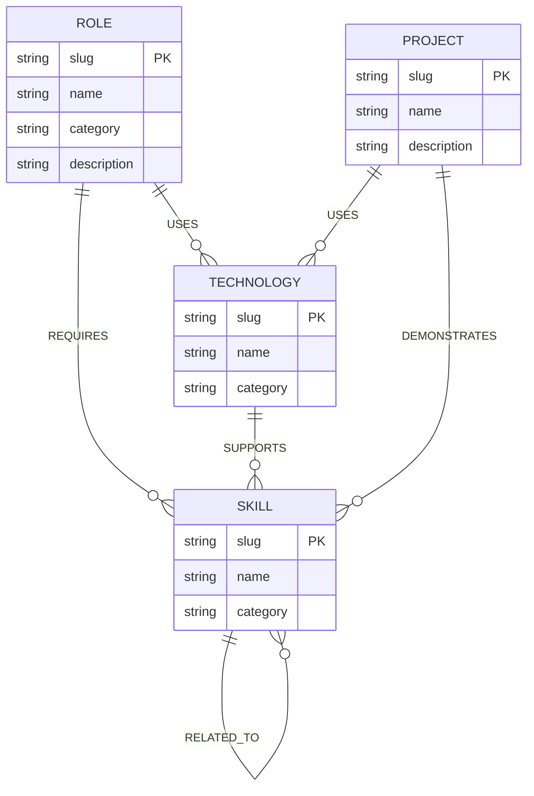

# PathGraph — Career Intelligence, Powered by a Graph

PathGraph is a small full-stack graph application that helps people explore how **roles, skills, technologies, and projects connect**. It is built for the Wexa AI CognoDB take-home assignment.

## Why a graph database?

Career information is naturally a network. A role connects to many skills; skills connect to technologies; technologies appear in projects; and roles overlap through shared skills. The useful questions are often traversal questions rather than simple lookups:

- Which roles are connected through shared skills?
- What skills connect my current profile to a target role?
- Which technologies are indirectly relevant to a role?
- What is the shortest explainable path between two career roles?

A relational schema can store the same facts, but multi-hop relationship exploration becomes increasingly dependent on repeated joins or recursive queries. A graph lets us express the relationships directly and traverse them with Cypher.

## Product

**PathGraph** has three focused views:

1. **Explore** — choose a target role and current skills.
2. **Career Path** — see matched skills, missing skills, related roles and recommended technologies.
3. **Graph Explorer** — inspect the connected subgraph visually.

The demo dataset is intentionally compact so it runs comfortably on CognoDB's free tier while still demonstrating meaningful graph behavior.

## Architecture

```mermaid
flowchart LR
    UI [HTML + CSS + JavaScript] → API [FastAPI]
    API --> DRIVER[Official Neo4j Python Driver]
    DRIVER --> DB[(CognoDB / openCypher over Bolt)]
```

## Data model



## Graph queries

### 1. Parameterized target-role analysis

The application calculates required skills, current matches and gaps using a parameterized target-role query.

### 2. Multi-hop traversal

The related-role endpoint traverses:

`Role → REQUIRES → Skill ← REQUIRES ← Role`

This is a two-hop relationship pattern used to discover roles that share the target role's skills.

### 3. Graph-native career path

The graph explorer uses a bounded variable-length traversal to return a connected neighborhood around the selected role. This is a relationship exploration problem that is much more natural in Cypher than repeatedly joining a normalized relational schema.

All user-controlled values are passed as Cypher parameters; no user input is concatenated into query strings.

## Project structure

```text
pathgraph/
├── backend/
│   ├── app/
│   │   ├── main.py
│   │   ├── config.py
│   │   ├── db.py
│   │   ├── models.py
│   │   └── repository.py
│   ├── __init__.py
│   └── requirements.txt
├── cypher/
│   ├── queries.cypher
│   └── schema.cypher
├── frontend/
│   ├── app.js
│   ├── index.html
│   └── styles.css
├── scripts/
│   └── seed.py
├── .env
├── .gitignore
├── DEMO_SCRIPT.md
├── Dockerfile
├── INTERVIEW_NOTES.md
└── README.md
```

## Local setup

### 1. Create a CognoDB instance

Create a free CognoDB instance using the instructions supplied with the assignment. Copy the Bolt URI and generated password.

### 2. Configure secrets

Create `.env` in the repository root:

```env
COGNODB_URI=bolt+s://<your-instance>.databases.cognodb.cloud
COGNODB_USER=cognodb
COGNODB_PASSWORD=<your-password>
```

Never commit `.env` or database credentials.

### 3. Backend

```bash
cd backend
python -m venv .venv
# Windows:
.venv\Scripts\activate
# macOS/Linux:
source .venv/bin/activate
pip install -r requirements.txt
cd ..
python scripts/seed.py
cd backend
uvicorn app.main:app --reload
```

API: `http://localhost:8000`

### 4. Run the web app

The production-minded version serves the polished frontend directly from FastAPI, so there is no Node build step. Start the API with:

```bash
cd backend
uvicorn app.main:app --reload
```

Open `http://localhost:8000`.

## Environment variables

| Variable | Purpose |
|---|---|
| `COGNODB_URI` | CognoDB Bolt connection URI |
| `COGNODB_USER` | Database username, normally `cognodb` |
| `COGNODB_PASSWORD` | Generated CognoDB password |
| `CORS_ORIGINS` | Comma-separated allowed frontend origins |
| `VITE_API_URL` | Backend URL used by the frontend |

## Error handling

The API returns a clear `503` response when the graph database cannot be reached. The UI turns that into a human-readable database connection state rather than displaying a raw stack trace.

## Production deployment

The backend is designed to run as a single FastAPI service. The frontend is served directly by FastAPI from the same service, keeping deployment simple and avoiding a second runtime. For a static-host deployment, the files under `frontend/` can also be served separately with the API URL adjusted in `app.js`.

For a quick free deployment, deploy the backend to a Python-compatible free hosting service and the frontend to a static hosting provider such as Vercel or Netlify. Keep CognoDB credentials only in the host's environment-variable settings.

## Demo walkthrough

1. Open Explore.
2. Select **Machine Learning Engineer**.
3. Select current skills such as Python, SQL and Git.
4. Click **Build my path**.
5. Review the match score and missing skills.
6. Inspect related roles and recommended technologies.
7. Open Graph Explorer to see the role/skill network.

## Screenshots

Add final screenshots here after deployment.

## Notes for reviewers

- Seed data is reproducible through `scripts/seed.py`.
- Database access uses the official Neo4j Python driver.
- Queries are parameterized.
- The UI intentionally exposes graph relationships rather than presenting CognoDB as a hidden implementation detail.
